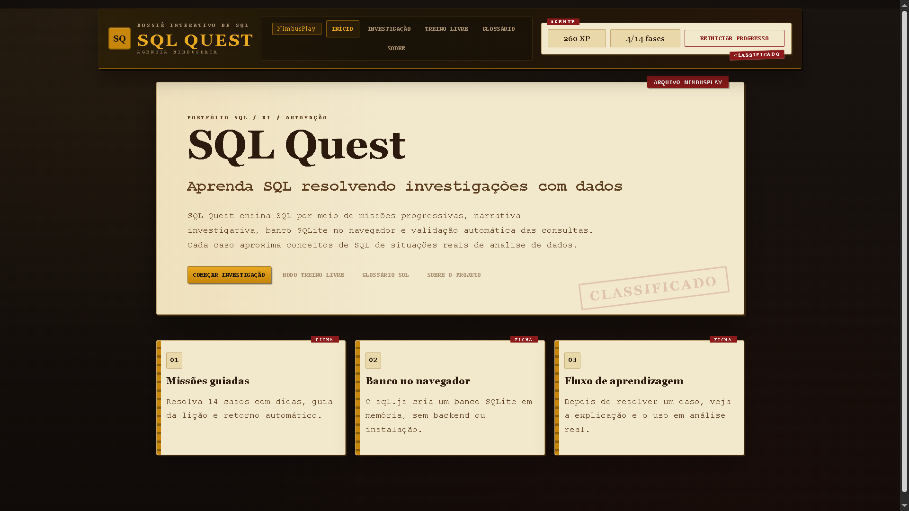
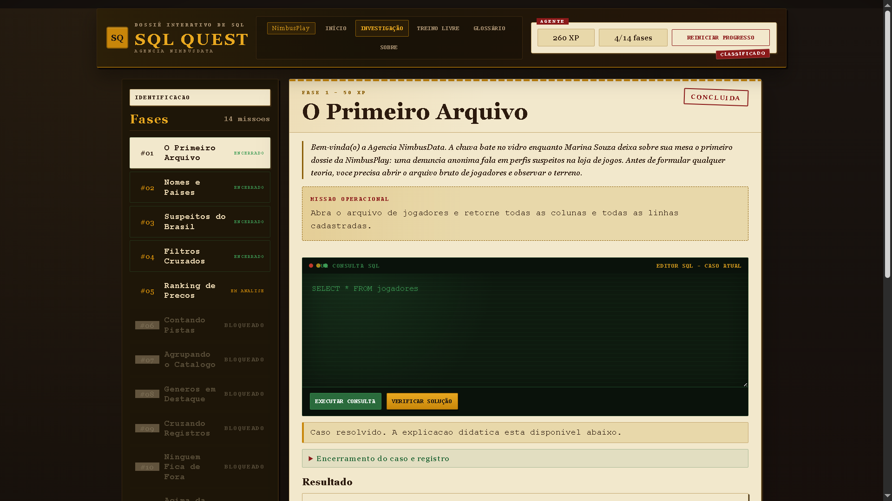
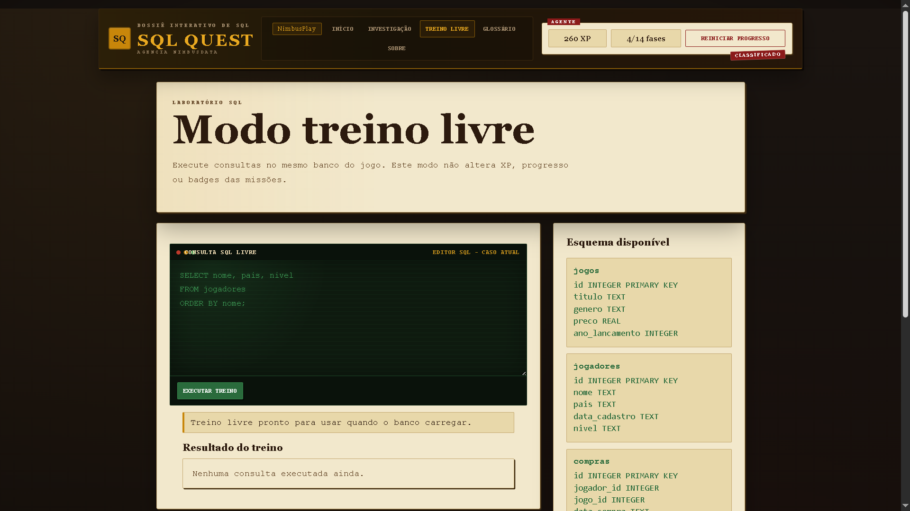
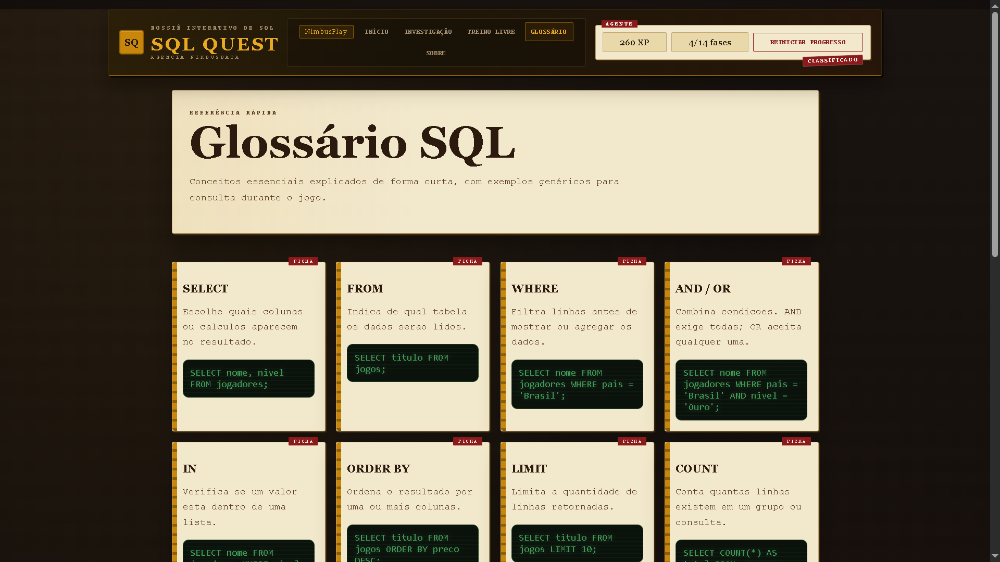
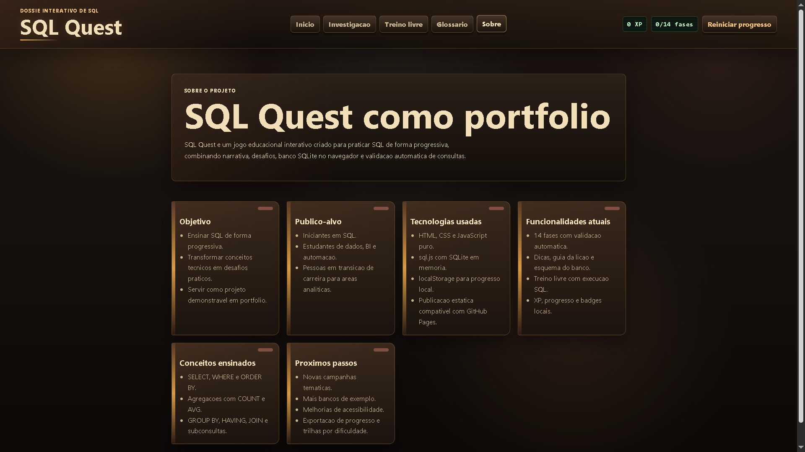

# 🕵️ SQL Quest

<p align="center">
  <strong>Aprenda SQL resolvendo investigações com dados.</strong><br>
  Um jogo educacional interativo com narrativa, progressão, validação automática e execução real de consultas no navegador.
</p>

<p align="center">
  <a href="https://brunogiacomelli1979-cyber.github.io/sql-quest-platform/">
    
  </a>
  
  
  
</p>

---

## 🎮 Demonstração

🔗 **Jogue online:**  
**[SQL Quest no GitHub Pages](https://brunogiacomelli1979-cyber.github.io/sql-quest-platform/)**

🔗 **Repositório:**  
**[sql-quest-platform](https://github.com/brunogiacomelli1979-cyber/sql-quest-platform)**

---

## 📸 Screenshots

> **Observação:** salve as imagens abaixo em uma pasta `images/` na raiz do projeto para que elas apareçam corretamente no GitHub.

### 🏠 Tela inicial


### 🧩 Área de investigação


### 🧪 Modo treino livre


### 📚 Glossário SQL


### 🧾 Página sobre o projeto


---

## 🗂️ Dossiê do Projeto

**SQL Quest** é um jogo educacional interativo criado para praticar **SQL** de forma progressiva, combinando:

- narrativa investigativa;
- desafios guiados;
- execução real de consultas SQL;
- validação automática;
- progressão por fases;
- experiência gamificada;
- publicação web estática.

O projeto foi desenvolvido como parte de um portfólio voltado à transição para a área de **Dados, BI e Automação**, demonstrando conhecimentos em:

- SQL;
- lógica de programação;
- JavaScript;
- experiência do usuário;
- estruturação de projetos front-end;
- gamificação aplicada ao aprendizado;
- versionamento com Git/GitHub;
- publicação com GitHub Pages.

---

## 🎯 Missão do Jogo

Transformar o estudo de SQL em uma experiência mais prática, visual e envolvente.

Em vez de apenas ler teoria, o jogador:

1. recebe uma missão;
2. consulta o esquema do banco;
3. escreve uma query SQL;
4. executa a consulta;
5. valida a solução;
6. recebe feedback;
7. avança para a próxima fase.

---

## 🧠 O que o jogador aprende

Ao longo da campanha, o jogador pratica:

- `SELECT`
- `FROM`
- colunas específicas
- `WHERE`
- operadores de comparação
- `AND` / `OR`
- `IN`
- `ORDER BY`
- `LIMIT`
- `COUNT`
- `AVG`
- `GROUP BY`
- `HAVING`
- `JOIN`
- filtros com `JOIN`
- subconsultas
- composição de relatórios finais

---

## 🕹️ Funcionalidades atuais

### ✅ Núcleo do jogo

- [x] 14 fases de aprendizagem
- [x] Progressão bloqueada por fase
- [x] Editor SQL interativo
- [x] Execução de consultas no navegador
- [x] Validação automática de solução
- [x] Dicas por lição
- [x] Guia da lição
- [x] Esquema do banco
- [x] Explicação pós-resolução

### ✅ Gamificação

- [x] XP por progresso
- [x] Badges/conquistas locais
- [x] Desbloqueio progressivo das fases
- [x] Fluxo de aprendizagem guiado
- [x] Modo treino livre

### ✅ Plataforma

- [x] Tela inicial
- [x] Navegação entre seções
- [x] Glossário SQL
- [x] Página “Sobre o projeto”
- [x] Salvamento local com `localStorage`
- [x] Publicação no GitHub Pages

---

## 🧭 Jornada do jogador

```text
Receber a missão
↓
Ler o enunciado
↓
Consultar o esquema do banco
↓
Escrever a query SQL
↓
Executar a consulta
↓
Validar a solução
↓
Receber feedback
↓
Desbloquear a próxima fase
```

---

## 🧪 Como funciona por trás

O SQL Quest utiliza **SQLite no navegador** por meio de **sql.js**.

Isso significa que o jogador executa consultas reais sem precisar instalar banco de dados, servidor ou ambiente local complexo.

### Fluxo técnico

```text
Banco SQLite em memória
↓
Carregamento no navegador
↓
Usuário escreve SQL
↓
Consulta é executada com sql.js
↓
Resultado é exibido
↓
Resposta é comparada ao esperado
↓
Progresso é salvo no localStorage
```

---

## 🏗️ Estrutura do projeto

```text
sql-quest-platform/
│
├── index.html
├── README.md
│
├── css/
│   └── style.css
│
├── js/
│   ├── app.js
│   ├── data.js
│   ├── database.js
│   ├── render.js
│   ├── state.js
│   └── validator.js
│
└── images/
    ├── sql-quest-home.png
    ├── sql-quest-investigacao.png
    ├── sql-quest-treino-livre.png
    ├── sql-quest-glossario.png
    └── sql-quest-sobre.png
```

---

## ⚙️ Tecnologias utilizadas

| Tecnologia | Função no projeto |
|---|---|
| **HTML5** | Estrutura da aplicação |
| **CSS3** | Layout, responsividade e identidade visual |
| **JavaScript** | Lógica do jogo, renderização e navegação |
| **sql.js** | Execução de SQLite no navegador |
| **SQLite** | Banco de dados usado nas missões |
| **localStorage** | Persistência local do progresso |
| **Git** | Versionamento |
| **GitHub** | Hospedagem do repositório |
| **GitHub Pages** | Publicação do projeto |

---

## 🚀 Como executar localmente

Este projeto não exige instalação de dependências.

### Opção 1 — Abrir direto no navegador

Abra o arquivo:

```text
index.html
```

### Opção 2 — Servidor local simples

Rode um servidor local:

```bash
python -m http.server 8000
```

Depois acesse:

```text
http://localhost:8000
```

---

## 🏆 Destaques de portfólio

Este projeto demonstra na prática:

- desenvolvimento front-end com HTML, CSS e JavaScript;
- organização modular de código;
- construção de produto educacional interativo;
- uso de SQL aplicado em contexto gamificado;
- criação de experiências de aprendizagem guiadas;
- persistência local de estado;
- publicação web estática profissional;
- evolução incremental com branches, merges e versionamento.

---

## 📦 Histórico de versões

| Versão | Descrição |
|---|---|
| `v0.1.0` | Estrutura inicial organizada do projeto |
| `v0.2.0` | Inclusão de modo portfólio, glossário, treino livre, badges e fluxo de aprendizagem |
| `v0.2.1` | Atualização visual com tema escuro retrô e foco em experiência de portfólio |

---

## 🗺️ Roadmap

### Próximas missões

- [ ] Revisar textos e narrativa das fases
- [ ] Melhorar ainda mais a responsividade mobile
- [ ] Adicionar revisão de erros do jogador
- [ ] Criar uma tela final de conclusão
- [ ] Adicionar screenshots/GIF mais refinados
- [ ] Evoluir para uma versão `v1.0.0`

### Campanhas futuras

- [ ] **NimbusPlay** — loja de games
- [ ] **AeroCargo** — logística aeroportuária
- [ ] **DataCorp** — desafios de negócio para analistas
- [ ] **SQL Crimes** — investigação e cruzamento de dados
- [ ] **City Data** — gestão pública e indicadores urbanos

---

## 🧩 Campanhas futuras: visão de plataforma

O SQL Quest pode evoluir para uma plataforma educacional com múltiplos cenários temáticos:

| Campanha | Tema | Aplicação |
|---|---|---|
| **NimbusPlay** | Loja de games | Aprendizado de SQL com narrativa investigativa |
| **AeroCargo** | Logística aeroportuária | Consultas focadas em operações, SLA e gargalos |
| **DataCorp** | Ambiente corporativo | SQL para análise de negócio |
| **SQL Crimes** | Investigação | Cruzamento de pistas e resolução de casos |
| **City Data** | Gestão pública | Análise de dados urbanos |

---

## 📈 Status do projeto

```text
Status atual: funcional, publicado e em evolução
Foco atual: consolidação como projeto de portfólio
Próximo passo: refinamento de conteúdo e expansão de campanhas
```

---

## 👨‍💻 Autor

**Bruno Giacomelli**  
Projeto desenvolvido como parte da transição para a área de **Dados, BI e Automação**.

- GitHub: [brunogiacomelli1979-cyber](https://github.com/brunogiacomelli1979-cyber)
- Projeto: [sql-quest-platform](https://github.com/brunogiacomelli1979-cyber/sql-quest-platform)

---

## 📜 Licença

Este projeto é de caráter educacional e de portfólio.

Se desejar, você pode adaptar a licença futuramente para algo mais formal, como **MIT License**.

---

## ⭐ Se este projeto te interessou...

Se você gostou da proposta, considere:

- dar uma ⭐ no repositório;
- testar o jogo no GitHub Pages;
- acompanhar as próximas versões.

---

<p align="center">
  <strong>SQL Quest</strong><br>
  <em>Aprender SQL também pode ser uma investigação.</em>
</p>
